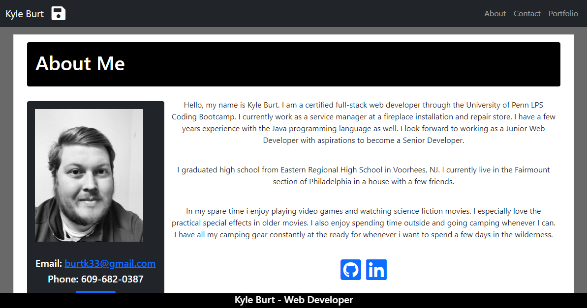
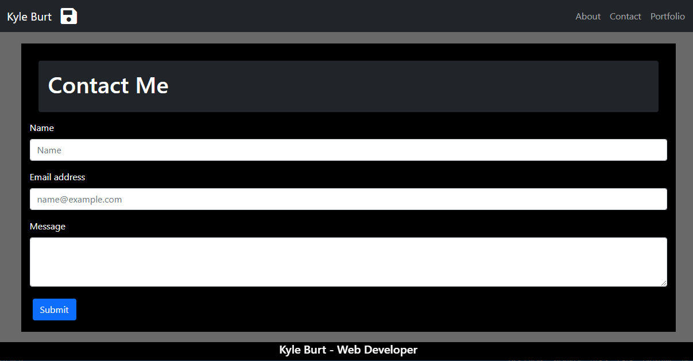
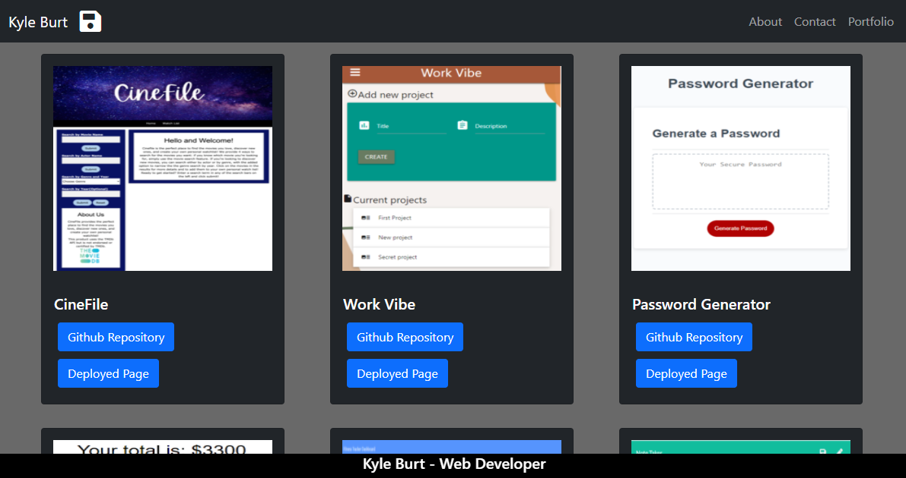

# Kyle Burt Portfolio

## Table of Contents

* [Description](#description)
* [Installation](#installation)
* [Usage](#usage)
* [Contribution Guidelines](#contribution-guidelines)
* [License](#license)
* [Questions](#questions)
    
## Description
A portfolio with About, Contact and Portfolio pages to showcase the web web development projects of Kyle Burt

[Deployed Page](https://burtk33.github.io/)

## Installation Instructions
Standard URL

## Usage
React based web application that displays projects and information about the developer

## Technologies
REACT

Bootstrap

React-Router

Node.js

## Contribution Guidelines
No contributions permitted

## License
*This project uses the MIT license.*

*Read more about it by clicking the link below*

[License Link](https://choosealicense.com/licenses/mit/)

## Questions
[Github Profile](https://github.com/burtk33)

I can be reached via email at burtk33@gmail.com